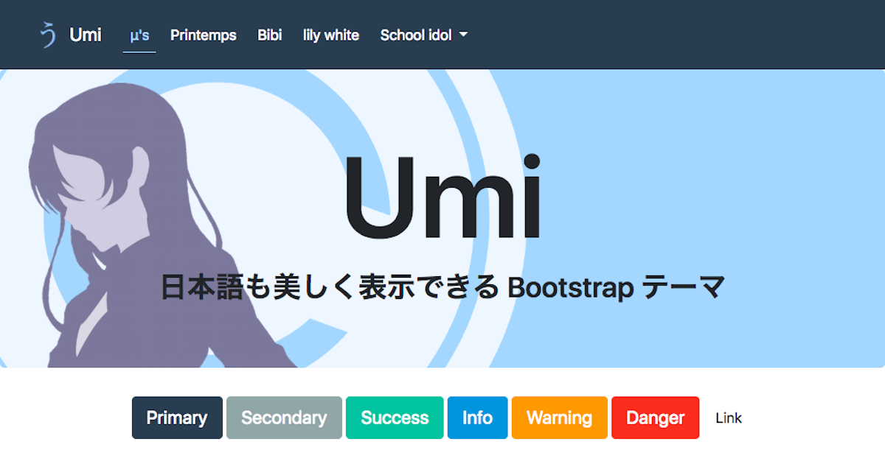

# Umi

[](https://travis-ci.org/ysakasin/Umi)
[](https://david-dm.org/ysakasin/Umi#info=devDependencies)
[](LICENSE)
[](https://www.npmjs.com/package/bootstrap-umi)

[https://ysakasin.github.io/Umi/](https://ysakasin.github.io/Umi/)

[](https://ysakasin.github.io/Umi/)

"Umi" は "Honoka"を元にした日本語も美しく表示できるBootstrapテーマです。

## About "Umi"

通常の [Bootstrap](http://getbootstrap.com/) では、日本語の表示が最適であるとはいえません。 "Honoka" では Bootstrap をベースに、日本語表示に適したフォントの指定や、ウェイトに関するコードを追記した Bootstrap テーマです。

"Umi"は"Honoka"にBootswatch Flatlyの配色を適応したテーマです。

## Live Demo

* [https://ysakasin.github.io/Umi/bootstrap-ja.html](https://ysakasin.github.io/Umi/bootstrap-ja.html) (日本語レイアウト)
* [https://ysakasin.github.io/Umi/bootstrap.html](https://ysakasin.github.io/Umi/bootstrap.html) (英語レイアウト)

## Getting Started

### Download

[Releases](https://github.com/ysakasin/Umi/releases) ページから最新版をダウンロードしてください。

### npm

Node.js のパッケージ管理システムである、 [npm](https://npmjs.com) で [公開されています](https://www.npmjs.com/package/bootstrap-honoka)。 [webpack](https://webpack.js.org/) など、npmを利用したmodule bundlerでご利用ください。

```
npm install --save bootstrap-umi
```

パッケージ名が「**bootstrap-**umi」であることに注意してください。

### Bower

[Bower](http://bower.io/) からインストールすることができます。

最新版をインストールするには以下のコマンドを実行してください。

```
bower install --save-dev $(node -e "$(curl -fsSL https://cdn.honokak.osaka/last.js)" ysakasin Umi)
```

もしcURLが入っていない環境の場合には、

```
bower install --save-dev Umi#(version)
```

`(version)` には Umi のバージョン番号を指定します(ex. `Umi#4.0.0`)。 Umi の最新バージョン番号は [Releases](https://github.com/ysakasin/Umi/releases) ページから確認してください。

## Usage

Umi は Bootstrap のテーマにしか過ぎないため、基本的な使い方は Bootstrap と変わりません。  Bootstrap のスタイルシートの読み込みを Umi のスタイルシートに置き換えることで動作します。また JavaScript のコードは変更されていないので、 Bootstrap のものを使っても問題ありません。

そのほか Bootstrap の機能の詳細については [Bootstrap のドキュメント](https://getbootstrap.com/docs/4.1/getting-started/introduction/) を参照してください。

### Package

配布している ZIP ファイルの内容物は以下のとおりです。 `bootstrap.min.css` といったように、ファイル名に `min` がついているファイルは、改行やインデント・スペーシングをなくした(minifyされた)コードで、ユーザがウェブページを読み込む際の転送量を少なくすることができます。通常はこの `bootstrap.min.*` を使うことをおすすめします。

```
umi/
├─ LICENSE
├─ README.md
├─ bootstrap.html
├─ css/
│  ├─ bootstrap.css
│  └─ bootstrap.min.css
└─ js/
    ├─ bootstrap.bundle.js
    ├─ bootstrap.bundle.min.js
    ├─ bootstrap.js
    └─ bootstrap.min.js
```

## Build

ビルドの方法については [Wiki](https://github.com/windyakin/Honoka/wiki) をご覧ください。

## License

[MIT License](LICENSE)

## Author of "Honoka"

* windyakin ([@MITLicense](https://twitter.com/MITLicense))

## Editor of "Umi"

* 酒田　シンジ ([@ysakasin](https://twitter.com/ysakasin))
